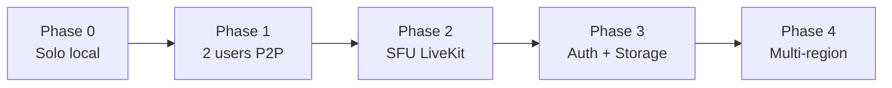

# Infraestructura — escala y crecimiento

## Objetivo

Crecer de **2 usuarios en jam experimental** a **decenas de sesiones concurrentes** sin romper boundaries del dominio.

## Fases de escala



| Fase | Usuarios | Media | Control | Persistencia | Hosting |
| --- | --- | --- | --- | --- | --- |
| **0 — Hoy** | 1 local | — | Supabase Realtime | Postgres + localStorage fallback | CF Pages free |
| **1 — Jam 2** | 2 por sala | WebRTC P2P adapter | Supabase Realtime | Postgres metadata | CF Pages |
| **2 — Salas** | 3–8 por sala | LiveKit SFU adapter | Realtime o dedicated WS | Postgres + Storage takes | Pages + LiveKit cloud |
| **3 — Producto** | 100+ MAU | LiveKit plan pago | Mismo + rate limits | Auth + RLS fino + CDN assets | Pages + Supabase Pro |
| **4 — Escala** | 1k+ MAU | SFU multi-region | Workers/Durable Objects opcional | Read replicas, asset lifecycle | Enterprise negociado |

## Regla: tres planos independientes

```text
CONTROL     → barato, frecuente, pequeño (KB/s)
MEDIA       → caro, crítico en tiempo (100–500 kb/s por stream)
PERSISTENCE → batch, durable (MB por take)
```

Escalar uno **no** obliga a escalar los otros al mismo ritmo.

## Cuándo cambiar cada adapter

### RealtimeMediaProvider

| Señal | Acción |
| --- | --- |
| 2 usuarios, misma ciudad, prueba | `PeerToPeerWebRTCProvider` |
| >2 participantes o NAT difícil | `LiveKitRealtimeMediaProvider` |
| Necesidad broadcast / recording cloud | SFU + egress policies |

Interface idéntica — ADR-007.

### SessionTransport

| Señal | Acción |
| --- | --- |
| Presence + tempo OK en Supabase | Mantener |
| Latencia control >100 ms o límites Realtime | `WebSocketTransport` dedicado (CF Worker) |
| Sync ultra-baja en LAN | WebRTC DataChannel (experimental) |

### ProjectRepository / AssetStorage

| Señal | Acción |
| --- | --- |
| Solo metadata | Postgres actual |
| Takes WAV/FLAC | Supabase Storage + signed URLs |
| Proyectos grandes / export | FileProjectRepository (.collabo zip) |

### AudioEngine / DSP

| Señal | Acción |
| --- | --- |
| FX simples | Web Audio nativo |
| NAM / amp models | WASM AudioWorklet detrás de `EffectProcessor` |
| CPU insuficiente medido | Perfil “low FX” automático, no más threads |

## Topología Phase 2 (referencia)

```text
                    ┌─────────────┐
                    │ LiveKit SFU │
                    └──────┬──────┘
           ┌───────────────┼───────────────┐
           ▼               ▼               ▼
      Cliente A        Cliente B       Cliente C
           │               │               │
           └───────────────┴───────────────┘
                           │
                    Supabase Realtime
                    (presence, transport)
                           │
                    Supabase Postgres
                    (sessions, projects)
```

## Límites y disparadores de upgrade

### Supabase Free → Pro

| Disparador | Umbral orientativo |
| --- | --- |
| DB size | >400 MB metadata |
| Egress | >4 GB/mes |
| Realtime concurrent | picos sostenidos cerca del límite |
| Auth MAU | producto público |

### Cloudflare Pages

Free suele alcanzar para SPA estática hasta tráfico moderado.  
Disparadores: build minutes, bandwidth — evaluar Workers solo si hace falta **lógica server** (tokens LiveKit, webhooks).

### LiveKit

Empezar cloud sandbox → plan por minutos/participantes cuando Phase 2 sea real.

## Datos que NO escalan linealmente

| Anti-patrón | Por qué |
| --- | --- |
| PCM en Postgres | Explota DB y egress |
| Mezclar control+media en un canal | Jitter en transport afecta todo |
| Un “latency number” en UI | No ayuda a debug multi-plano |
| IA predictiva global | CPU + artefactos sin arreglar local |

## Observabilidad al crecer

| Métrica | Fase mínima |
| --- | --- |
| path ms local | 0 |
| control RTT/jitter | 0 |
| media RTT, loss, jitter | 1 |
| clock offset/drift | 2 |
| SFU participant minutes | 2 |
| storage GB, egress | 3 |

Export debug JSON (CollaboDAW) → base para soporte y research.

## Migración de código (monorepo)

ADR-009: packages solo cuando un **segundo runtime** los necesite (ej. Worker API, desktop helper).

Orden sugerido de extracción:

1. `packages/domain`
2. `packages/project-format`
3. `packages/audio-engine` (si native helper aparece)
4. `packages/realtime`

No extraer prematuramente — el costo es CI y versionado.

## Gate before scaling media

Architecture research closed 2026-09-21 (`docs/research/2026-09-21-LATENCY-AUDIO-MONITORING-FINAL.md`).

Before Phase 1 (P2P) productiva:

1. Audio Lab benchmarks on UMC22 / iTrack Solo / Scarlett Solo
2. Document `baseLatency`, `outputLatency`, subjective feel 1–5
3. Dry record slice (Milestone 4)
4. WebRTC audio mínimo 2-user (Milestone 7)

Do not scale LiveKit SFU before local + P2P evidence.

Ver `docs/learn/` y `docs/ROADMAP.md` Milestones 4–7.

## Referencias

- `docs/ARCHITECTURE.md`
- `docs/REALTIME.md`
- `docs/SUPABASE-LIMITS.md`
- `docs/DECISIONS.md`
