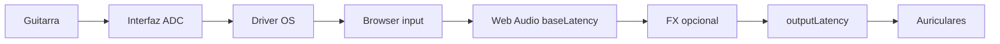

# 01 — Latencia en audio web

## En una frase

**Latencia** = tiempo entre que tocás una nota y la oís en los auriculares.

En el browser medimos **partes** de ese camino, no siempre el total real.

## Desglose (no un solo número)

```text
Guitarra → ADC interfaz → driver → browser capture
       → Web Audio graph (baseLatency)
       → mezcla / FX
       → salida browser (outputLatency)
       → DAC → auriculares → oído
```



| Métrica | Qué mide | Qué NO mide |
| --- | --- | --- |
| `baseLatency` | Buffer interno del AudioContext | Latencia del ADC/DAC |
| `outputLatency` | Cola de salida del browser | Direct Monitor hardware |
| **path ms** (CollaboDAW) | base + output reportados | Instrumento→oído completo |
| RTT Supabase | Ida y vuelta de **control** | Audio entre guitarristas |

## Targets de producto (ADR-018)

| Banda local (software monitor) | Significado |
| --- | --- |
| <10 ms | excelente |
| 10–15 ms | **objetivo preferido** |
| 15–20 ms | experimental / usable |
| 20–30 ms | alto para instrumento |
| >30 ms | fuera de objetivo |

Ver `docs/specs/LATENCY-TARGETS.md`.

## Ejemplo medido (UMC22 ~2026-09 — validar en tu máquina)

```text
baseLatency   ≈ 10 ms
outputLatency ≈ 65–70 ms
path ms       ≈ 75–80 ms   ← solo software monitor (parcial)
```

Si activás **Direct Monitor** en la UMC22, gran parte del camino **no pasa** por esos 70 ms de output del browser — el browser no puede medir ese tramo.

## Prueba en CollaboDAW

1. Abrí Studio → Diagnostics.
2. Anotá **base**, **output**, **path ms**.
3. Cambiá Primary output: **Behringer** vs **Realtek**.
4. Repetí con preset **live** vs **record**.
5. Copiá **debug JSON** y compará.

**Esperado:** Realtek y preset `record` suelen empeorar el path software.

## Analogía

Un DAW en el browser es como un restaurante con **dos cocinas**:

- **Cocina A (Direct Monitor):** plato directo del proveedor (interfaz) — rápido.
- **Cocina B (software):** pasa por el browser — más pasos, más espera.

No confundas el ticket de la Cocina B con el tiempo total si también comés de la A.

## Referencias

- [MDN AudioContext](https://developer.mozilla.org/en-US/docs/Web/API/AudioContext)
- [Chromium latency tracing](https://chromium.googlesource.com/chromium/src/+/HEAD/docs/media/latency_tracing.md)
- `docs/AUDIO.md`
