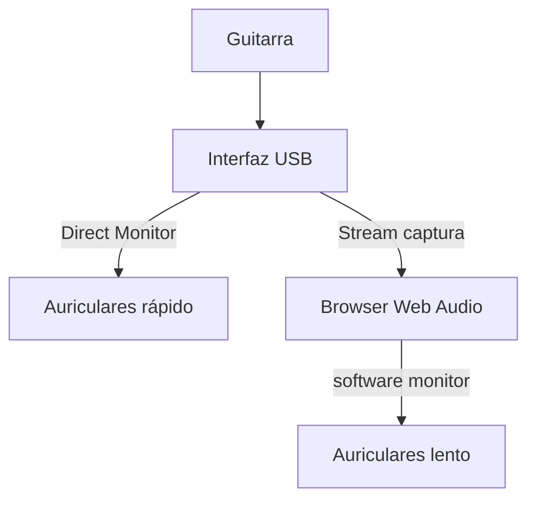

# 02 — Direct Monitor vs software monitor

## En una frase

**Direct Monitor** = la interfaz mezcla entrada→salida **sin** pasar por el browser.  
**Software monitor** = oís lo que procesa Web Audio (más flexible, más lento).

## Diagrama

```text
                    ┌── Direct Monitor ──→ auriculares  (≈ pocos ms HW)
Guitarra → interfaz ┤
                    └── USB → browser → Web Audio → auriculares  (≈ 50–80+ ms)
```



## Cuándo usar cada uno

| Situación | Recomendación |
| --- | --- |
| Tocar en vivo, feeling | Direct Monitor ON, software monitor OFF |
| Necesitás reverb/amp solo en headphones | Software monitor ON (aceptás latencia) |
| Grabar dry + oír hardware | Direct Monitor + dry tap en app (futuro) |
| Speakers abiertos + mic | Peligro feedback — headphones |

## Presets propuestos (investigación)

| Preset | Monitor SW | Idea |
| --- | --- | --- |
| Feel | off | Máximo feeling |
| Monitor SW | on | Probar FX/browser |
| Capture | off | Grabación estable |

La IA **no** reemplaza Direct Monitor para latencia local.

## Prueba A/B (5 minutos)

1. Conectá guitarra a UMC22.
2. **Prueba A:** Direct Monitor ON, Mute monitor en app → tocá escala.
3. **Prueba B:** Direct Monitor OFF, Monitor ON en app → misma escala.
4. Anotá sensación 1–5 y path ms en Diagnostics.

Si B se siente “tarde”, no es un bug — es física + buffers del browser.

## Error común

> “Bajé sample rate a 44.1k y sigo sintiendo delay.”

Porque el cuello suele ser **outputLatency** (~65 ms), no el sample rate.

## Referencias

- Manual UMC22 / Focusrite (Direct Monitor / MIX)
- `docs/DEVICE-COMPATIBILITY.md`
