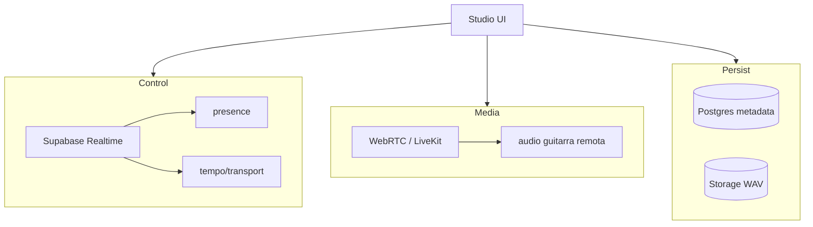

# 03 — Control plane vs media plane

## En una frase

**Control** = quién está en la sesión, BPM, transport (mensajes chicos).  
**Media** = el audio de la guitarra en vivo (mucho dato, tiempo real).

CollaboDAW **no** mezcla los dos en el mismo tubo.

## Diagrama de tres planos

```text
┌──────────────── CONTROL PLANE ────────────────┐
│ Supabase Realtime / WebSocket                 │
│  · presence (quién está)                      │
│  · transport / tempo map                      │
│  · RTT probe (diagnóstico)                    │
└───────────────────────────────────────────────┘

┌──────────────── MEDIA PLANE ──────────────────┐
│ WebRTC / LiveKit                              │
│  · audio mic/guitar entre personas            │
│  · Opus o PCM según experimento               │
└───────────────────────────────────────────────┘

┌──────────────── PERSISTENCE PLANE ────────────┐
│ Supabase Postgres + Storage                   │
│  · metadata de sesión/proyecto                │
│  · archivos de audio (futuro)                 │
└───────────────────────────────────────────────┘
```



## Regla ADR

**WebSocket no es el transporte principal de instrumentos en vivo.**

Motivo: retransmisiones, jitter buffer TCP-friendly — malo para feel de jam.

## Qué mide hoy CollaboDAW

| Métrica en Diagnostics | Plano |
| --- | --- |
| Control RTT / jitter | Control |
| base / output latency | Local audio |
| Sync offset / drift | Media (aún “not measured”) |

No interpretes RTT de Supabase como latencia de la guitarra del amigo.

## Prueba

1. Diagnostics → **Measure network** → anotá RTT.
2. Compará con **path ms** local.
3. Son números de **cosas distintas**.

## Mute vs Unsubscribe

| | Mute | Unsubscribe |
| --- | --- | --- |
| Media llega | Sí | No |
| Se oye en mix | No | N/A |
| Ahorra bandwidth | No | Sí |

## Objetivo futuro (después de medir local)

```text
Vos: guitarra → Direct Monitor (feel local, hardware)
     guitarra → WebRTC → amigo (media plane)
Ambos: click local sincronizado por SessionClock (control)
```

Gate: ver `docs/ARCHITECTURE.md` — no WebRTC antes de benchmarks locales.

## Referencias

- `docs/REALTIME.md`
- `docs/DECISIONS.md` ADR-001
