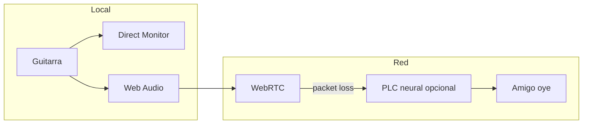

# 04 — PLC vs predicción IA (qué ayuda al tocar)

## En una frase

**PLC (Packet Loss Concealment)** repara **huecos** cuando se pierde un paquete de red.  
**Predicción** intentaría adivinar notas **futuras** — peligroso en música.

## Analogía videojuegos vs guitarra

| Dominio | Técnica | Por qué funciona |
| --- | --- | --- |
| FPS online | Predicción de posición del enemigo | Si falla, un frame raro |
| Guitarra en vivo | Predicción de nota siguiente | Si falla, **otra melodía** |

El audio musical es **causal**: la nota existe después de que la tocás, no antes.

## Dónde sí encaja la IA (investigación abierta)

```text
Tu oído local
  └─ Direct Monitor / Web Audio     ← IA NO quita outputLatency

Red hacia amigo
  └─ Opus/WebRTC
       └─ packet loss
            └─ PLC neural (opcional)  ← IA puede ayudar AQUÍ

Monitor con color
  └─ NAM / amp model (WASM)         ← IA de timbre, suma CPU/latencia
```



## Modos IA (ADR-019, default off)

| Modo | Rol | ¿Activo hoy? |
| --- | --- | --- |
| off | Baseline honesto — **todos los benchmarks empiezan aquí** | sí |
| remote-plc | Suavizar drops remotos (receptor) | no — futuro |
| experimental | NAM / FX neural | no — futuro |

**Regla de producto:** presets de latencia (Feel / Monitor / Capture) **no** encienden IA. Arquitectura cerrada 2026-09-21; ver `docs/research/2026-09-21-LATENCY-AUDIO-MONITORING-FINAL.md`.

## Preguntas para cerrar en investigación GPT

1. ¿PLC añade latencia al receptor?
2. ¿En qué % packet loss vale la pena?
3. ¿NAM en AudioWorklet cabe en budget de 10 ms base?

Ver prompt: `prompts/05-LATENCY-IA-RESEARCH.md`

## Anti-patrones

- “IA predice lo que vas a tocar para compensar 70 ms”
- Un toggle “Low latency AI” sin decir **dónde** actúa
- Mezclar PLC remoto con feeling de Direct Monitor local

## Referencias

- INTERSPEECH PLC Challenge (buscar ediciones recientes)
- [neural-amp-modeler-wasm](https://github.com/tone-3000/neural-amp-modeler-wasm)
- `prompts/05-LATENCY-IA-RESEARCH.md`
