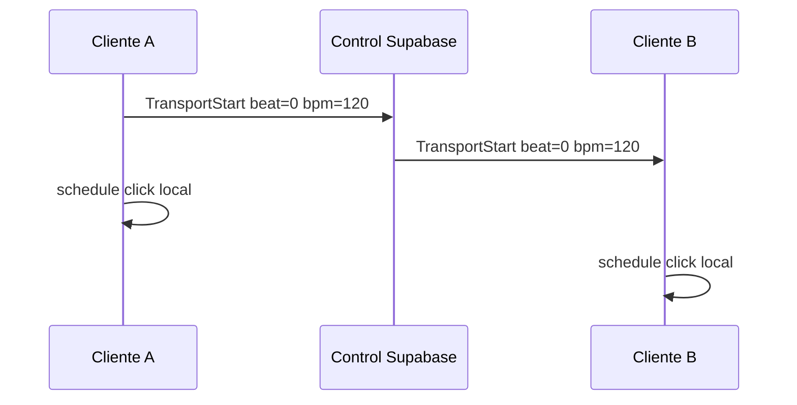

# 05 — Reloj musical y sincronización

## En una frase

Cada músico genera el **click en su AudioContext**; la sesión comparte **BPM, tempo map y transport**, no el audio del metrónomo.

## Por qué no transmitir el click por red

```text
❌ Host genera click → WebRTC → invitado oye click
   Problema: jitter de red → click del amigo llega tarde

✅ Host dice: "Play en beat 0 @ 120 BPM"
   Cada cliente programa click local con AudioContext.currentTime
```



## Tres relojes distintos (no mezclar)

| Reloj | Dueño | Uso |
| --- | --- | --- |
| `AudioContext.currentTime` | Browser local | Programar click, FX, fades |
| `SessionClock` | Dominio CollaboDAW | Mapear tiempo de sesión → audio local |
| `requestAnimationFrame` | UI | Meters, no música |

## Sync remoto (futuro)

Para que dos guitarristas suenen juntas hace falta medir:

- **offset** — cuánto está adelantado/atrasado el otro
- **drift** — los relojes se desincronizan con el tiempo
- **RTT** — ida y vuelta para estimar offset

**Soft correction:** ajustar eventos futuros.  
**Hard resync:** botón que realinea en un downbeat.

Hoy en Diagnostics: sync offset = “not measured (needs WebRTC)”.

## Prueba local del click

1. Start audio en Audio Lab.
2. Play en transport → oís click.
3. Cambiá BPM → el click sigue estable (scheduling local).

## Jam remoto realista

Referencias de la industria NMP:

- Jamulus apunta ~30–50 ms one-way en condiciones buenas
- >50–70 ms ya cuesta mantener groove

CollaboDAW debe **medir y mostrar** desglose, no prometer “cero ms”.

## Referencias

- `docs/REALTIME.md`
- `docs/DECISIONS.md` ADR-002
